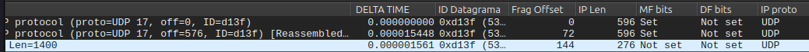
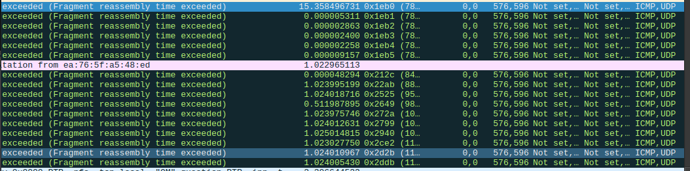

# TP1 -  - Sistemas Distribuidos (75.43)

## Aplicacion de File Transfer entre hosts Cliente y Servidor

## Dependencias

- Instalar openvswitch y xterm
```sh
sudo apt update
sudo apt install openvswitch-testcontroller
sudo apt install xterm
sudo apt install mininet
```

## Ejecutando el proyecto

- Para correr el script de la topologia en mininet (upload)
```sh
sudo python3 src/lib/Mininet/upload_topology.py
```
- Para correr el script de la topologia en mininet (download)
```sh
sudo python3 src/lib/Mininet/download_topology.py
```

- Ejecutar el servidor
```sh
python3 src/start_server.py -H 127.0.0.1 -p 9000 -s src/lib/Server/downloads -r stop_and_wait
```

- Ejecutar el cliente
  - Upload
```sh
python3 src/upload.py -H 127.0.0.1 -p 9000 -s src/lib/Client/uploads/momo.jpeg -n copia4.jpeg -r stop_and_wait
```
  - Download
```sh
python3 src/download.py -H 127.0.0.1 -p 9000 -d src/lib/Client/downloads/nashe.jpeg -n momo.jpeg -r stop_and_wait
```

- Correr tests
  - Upload
```sh
python3 src/lib/Tests/upload_stress_test.py 
```
  - Download
```sh
python3 src/lib/Tests/download_stress_test.py 
```

## Anexo, Fragmentación IPv4: Objetivo

### Objetivo

Este experimento tiene como objetivo observar y comprender el proceso de fragmentación en IPv4, así como el comportamiento de los protocolos TCP y UDP ante la pérdida de fragmentos, y el impacto del MTU en el volumen de tráfico. Para ello, se diseña una red virtual en Mininet que simula un entorno donde la fragmentación ocurre de manera controlada y medible.

Comprobar empíricamente:
- El proceso de **fragmentación IPv4**.
- El comportamiento de **TCP** y **UDP** ante la pérdida de fragmentos.
- El **aumento de tráfico** al reducirse el MTU mínimo en la red.

Para esto se utiliza:
- **Mininet** para simular la red.
- **iperf** para generar tráfico TCP/UDP.
- **Wireshark** para capturar y analizar los paquetes.

---

## Estructura del experimento

El experimento está automatizado mediante un script de Python que utiliza Mininet para crear la red, aplicar configuraciones, y levantar los servicios necesarios.

### Topología
Se construyó una topología lineal en Mininet conformada por dos hosts (h1 y h2) conectados a través de tres nodos intermedios. El nodo central (s2) se implementó como un router (usando una clase personalizada que habilita el reenvío de paquetes mediante ip_forward), mientras que los extremos (s1 y s3) actúan como switches.


```
h1 --- s1 --- s2 --- s3 --- h2
```

- 2 hosts (`h1`, `h2`)
- 3 switches intermedios
  - Se usa un nodo en lugar de un switch en el centro de la topologia (s2), y a este nodo se le setea que pueda hacer ip-forwarding, ya que esto es lo que lo hace comportarse como un router.
- MTU reducido en una interfaz de `s2`: `s2-eth2`.
- Pérdida de paquetes simulada en una interfaz de `s3`.

---

## Instrucciones paso a paso

### Preparación del entorno

Instalar Mininet, iperf y Wireshark
```bash
sudo apt update
sudo apt install mininet iperf wireshark
```

Limpiar interfaces  huerfanas
```bash
sudo mn -c
```

### Correr el trabajo

El script de fragmentación propone la siguiente interfaz:
```bash
fragmentacion.py [--mtu MTU] [--loss LOSS]
```

#### 1. Ejecutar el script de fragmentación, inicialmente sin pérdida de paquetes


Desde el root
```bash
sudo python3 src/lib/Anexo/fragmentacion.py --mtu 600 --loss 0
```

#### 2. Abrir wireshark

Analizar `s1-eth2` y `s3-eth2` para ver la fragmentacion de paquetes. En `s1` se verán los paquetes enviados, como paquetes completos, y en `s3` se verán los paquetes fragmentados.


#### 3. Enviar trafico

##### UDP
```bash
mininet> h2 iperf -s -u &
mininet> h1 iperf -c h2 -u -l 1400
```

##### TCP
```bash
mininet> h2 iperf -s &
mininet> h1 iperf -c h2 -l 1400
```

#### Analizar trafico en wireshark
- Ver como cada paquete aparece fragmentado, de la siguiente forma en `s3-eth2`:

- Ver los campos relevantes:
  - `Identification`: Identificador del paquete.
  - `Flag MF`: Indica si hay más fragmentos.
  - `Fragment Offset`: Indica la posición del fragmento en el paquete original.
  - `IP Len`: Longitud del paquete fragmentado.
- Comparar como la fragmentacion afecta el trafico en la red. En cada captura de Wireshark hacer `Statistics > Summary` y observar el total de paquetes en la red. Se vera algo del estilo:
    - En `s1-eth2` hay 941.
    - En `s3-eth2` hay 2821.
- En TCP vamos a ver mucho mas trafico que en UDP porque TCP envia ACKs, pero no vamos a ver paquetes retransmitidos porque no hay perdida de paquetes.

#### 4. Ejecutar el script con pérdida de paquetes

```bash
sudo python3 src/lib/Anexo/fragmentacion.py --mtu 600 --loss 10
```

#### 5. Abrir wireshark

Nuevamente, analizar `s1-eth2` y `s3-eth2` para ver la fragmentacion de paquetes. En `s1` se verán los paquetes enviados, como paquetes completos, y en `s3` se verán los paquetes fragmentados.

#### 6. Enviar trafico

##### UDP
```bash
mininet> h2 iperf -s -u &
mininet> h1 iperf -c h2 -u -l 1400
```

##### TCP
```bash
mininet> h2 iperf -s &
mininet> h1 iperf -c h2 -l 1400
```

#### Analizar trafico en wireshark

- Ya vemos desde mininet que hay una perdida de paquetes.
- Que pasa cuando se pierde un fragmento?
    - En UDP
        - Si un fragmento se pierde, el host destino descarta todo el datagrama.
        - No hay retransmisión.
        - Vas a ver fragmentos huérfanos: algunos fragmentos de un mismo `ID Datagrama` pero no todos, y no vas a ver la reensamblación.
        - En iperf se ve pérdida de paquetes reportada (X% datagrams lost).
        - En la captura se observan múltiples mensajes ICMP con el tipo "Fragment reassembly time exceeded", lo que indica que el host receptor descartó datagramas IP fragmentados debido a la pérdida de alguno del paquete.
        
    - En TCP
        - TCP detecta la pérdida y retransmite todo el datagrama.
        - Filtrar retransmisiones
            - Retransmisiones por perdida o timeout: `tcp.analysis.retransmission`.
            - Retransmisiones por retransmision rapida `tcp.analysis.fast_retransmission`.
            - Retransmisiones por timeout `tcp.analysis.retransmission && !tcp.analysis.fast_retransmission`.
        - Los reenvios se ven con el `TCP Retransmission` en la info del paquete. Se ven dos tipos distintos de retransmisiones: `TCP Retransmission` y `TCP Fast Retransmission`.
            - La primera es por timeout y la segunda por 3 ACKs duplicados.

### Resultados observados
1. *Proceso de fragmentación*
Al generar tráfico con tamaño mayor al MTU del enlace (600 bytes), Wireshark muestra cómo se divide un paquete en múltiples fragmentos IPv4, identificables por el mismo ID de paquete, campos MF y offsets. La fragmentación es manejada por el router s2.

2. *Comportamiento de TCP ante pérdida de fragmentos*
Al introducir pérdida en el `s3`, se observó que TCP retransmite automáticamente el paquete completo cuando falta un fragmento, dado que TCP requiere entrega confiable. Esto implica mayor latencia y tráfico adicional por retransmisiones.

3. *Comportamiento de UDP ante pérdida de fragmentos*
En el caso de UDP, si se pierde uno de los fragmentos, el datagrama completo no puede ser reconstruido y se descarta sin notificación. Esto se refleja en que iperf muestra pérdida de paquetes sin intento de recuperación, ya que UDP no implementa mecanismos de fiabilidad.

4. *Aumento del tráfico al reducirse el MTU*
La reducción del MTU implica una mayor cantidad de fragmentos para transmitir la misma cantidad de datos. Esto genera un aumento del número total de paquetes enviados y una sobrecarga en la red. Esta condición se confirmó al observar un mayor número de paquetes IP en Wireshark durante transmisiones con MTU reducido.

### Conclusión
El experimento permitió verificar de forma práctica cómo funciona la fragmentación en IPv4 y cómo se comportan los protocolos de transporte TCP y UDP ante la pérdida de fragmentos. Se concluye que una MTU reducida no solo causa fragmentación, sino que también incrementa el tráfico de red.
